# Datum Explorer application manual

The Datum Explorer application is a user-friendly tool designed to parse and manage Cardano datums efficiently. It supports schema selection, automatic schema detection, and the ability to define and maintain local schemas.

## Selecting schema

To parse a datum, first select the schema you wish to use. The app lists all schemas from the [cardano-datum-registry](https://github.com/WingRiders/cardano-datum-registry), along with additional options:

- Detect schema
- Your local schemas
- Add a new local schema

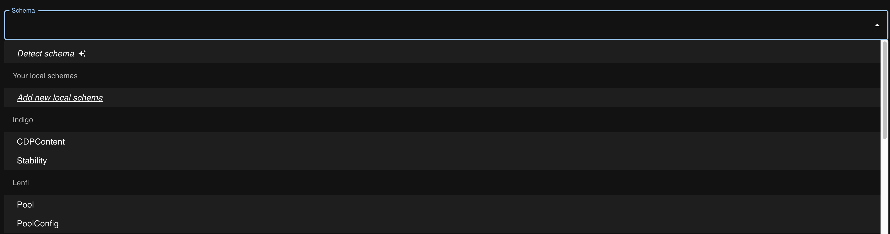

## Parsing datum

After selecting a schema, enter the datum's CBOR. If the CBOR is valid, the app displays the parsed datum:

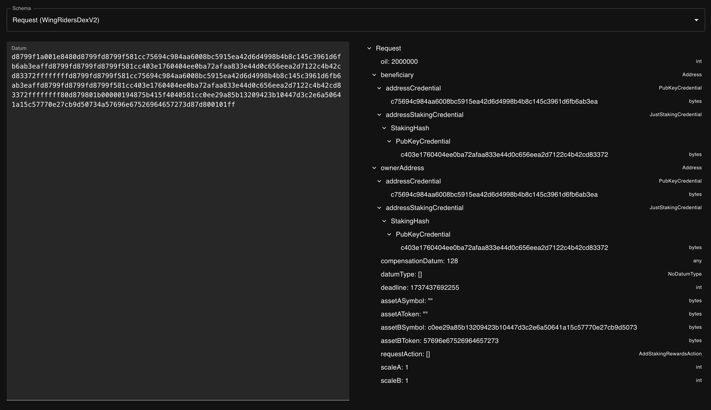

If the CBOR is invalid, an error message appears:

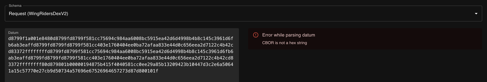

If the CBOR is valid but doesn't match the selected schema, you'll see an error message:

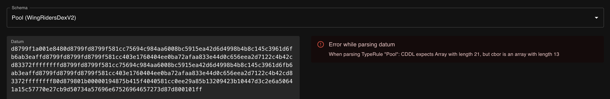

## Automatic schema detection

If you have a datum's CBOR but don't know its schema, use the automatic schema detection feature. First, select the `Detect schema` option:

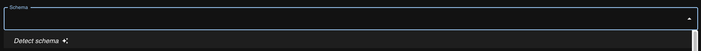

Next, enter the datum's CBOR. The app attempts to parse it against all available schemas (registry and local). You can switch between detected results:

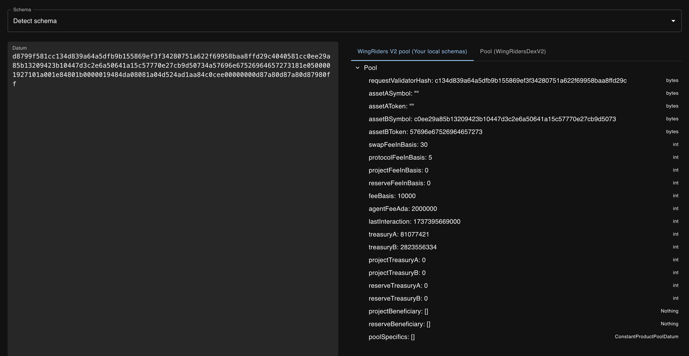

If no schemas match, the app informs you:

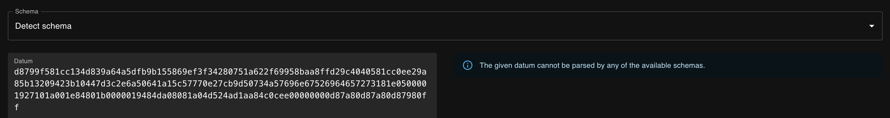

## Local schemas

In addition to schemas from the remote registry, you can define local schemas available only on your device.

### Add new local schema

To add a local schema, click the `Add new local schema` button in the schema selection dropdown:

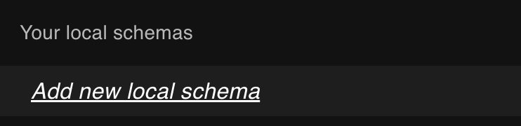

Enter the schema's name and its CDDL definition:

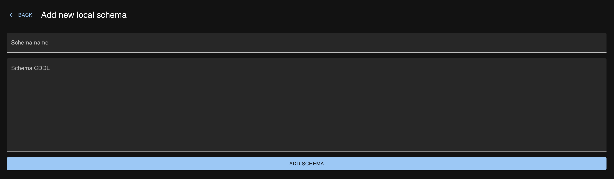

Click the `Add schema` button. The new schema appears in your local schemas:

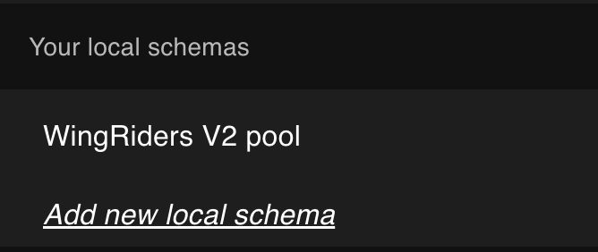

If there's an error in your schema's CDDL, an error message appears with details:

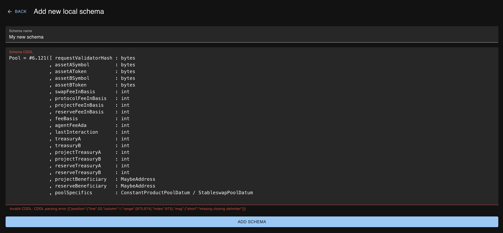

### Edit local schema

To edit an existing local schema, click the edit icon next to its name:

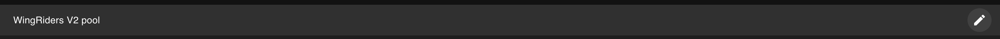

Update the schema name or CDDL, then click `Save`:

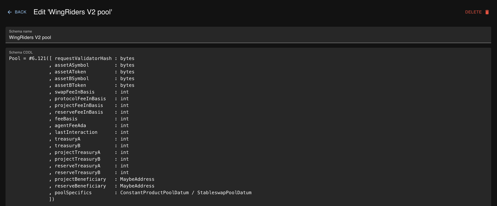

### Delete local schema

To delete a local schema, click the `Delete` button while editing the schema:

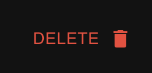

Then confirm deletion:

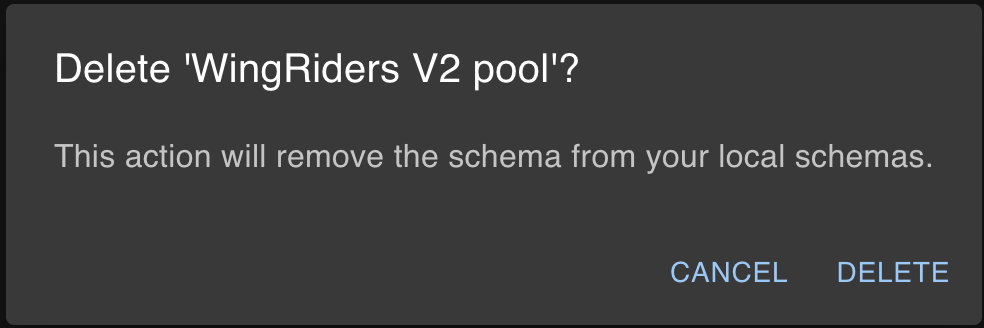
