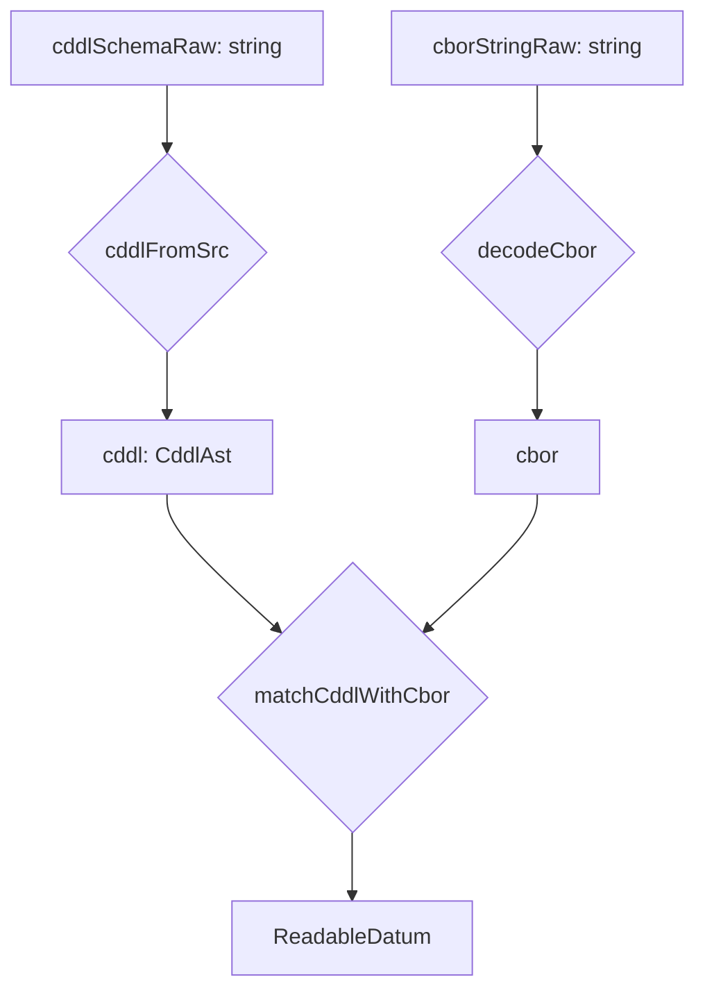
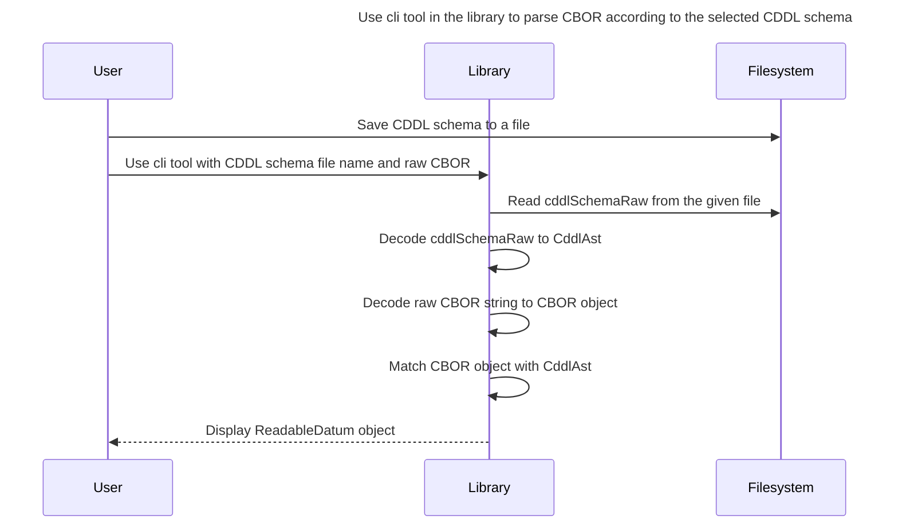
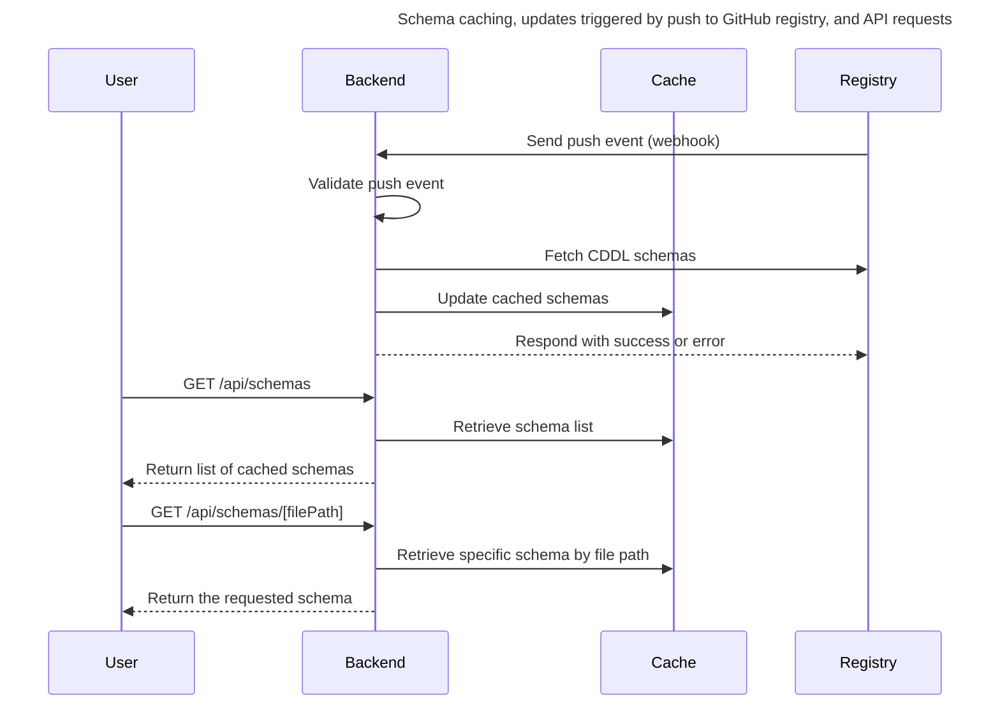

# Architecture

The Datum Explorer architecture is designed to efficiently decode CBOR data using schema definitions.
The core functionality is implemented using Rust, WebAssembly (WASM), and TypeScript libraries,
ensuring high performance and seamless integration with modern web applications.

## Components

The Datum Explorer is composed of four primary components: **[Library](#Library)**, **[Registry](#Registry)**, **[Backend](#Backend)** and **[Frontend](#Frontend)**.

- **Library** handles the core functionality, including decoding CDDL and CBOR, matching data, and providing a CLI tool for schema-based parsing.
- **Registry** serves as the source of truth for CDDL schemas, enabling schema updates and contributions via a GitHub repository.
- **Backend** ensures synchronization between the Registry and an in-memory cache, exposing a set of API endpoints to retrieve cached schemas and trigger cache updates.
- **Frontend** allows users to parse Cardano datums

### Library

- CDDL decoding
  - Utilizes the [cddl](https://github.com/anweiss/cddl/) Rust crate to decode CDDL (Concise Data Definition Language) from a string into an Abstract Syntax Tree (AST).
  - **WASM Wrapper**: Wraps the Rust library for use in web environments, enabling the decoding of CDDL into a structured AST.
- CBOR decoding
  - Uses the [cbor-x](https://github.com/kriszyp/cbor-x) library to parse raw CBOR string into a structured format.
- CDDL - CBOR matching
  - Uses CDDL decoding and CBOR decoding to obtain traversable structures.
  - Matches the decoded CBOR against the CddlAst to produce a final JSON representation.
  - The pipeline involves several key intermediary structures:
    - **CddlAst**: Represents the AST produced by decoding the CDDL schema.
    - **cbor**: Represents the result of decoding the raw CBOR string by the cbor-x library. Its type is unknown and is unfolding when matching with CddlAst.
    - **ReadableDatum**: Represents the final matched structure.
- CDDL validation
  - Uses CDDL decoding to obtain a traversable structure.
  - Checks for unsupported CDDL features and reports validation errors.
- CLI tool
  - Uses CDDL - CBOR matching to display ReadableDatum for the given CDDL schema and raw CBOR data.

#### Library workflow



#### Component interaction



### Registry

- Holds the CDDL schema definitions.
- Allows the public to contribute new schemas and updates via a GitHub repository.
- Push to main branch calls backend endpoint which triggers cache update.

### Backend

- Built using [Next.js](https://nextjs.org/).
- Synchronizes the Registry from GitHub to an in-memory cache.
- Exposes a few key endpoints for managing and accessing CDDL schemas.

#### Endpoints overview

| Endpoint                  | HTTP Method | Description                          | Example Response              |
| ------------------------- | ----------- | ------------------------------------ | ----------------------------- |
| `/api/healthcheck`        | `GET`       | Returns health info.                 | `{ "healthy": true, ... }`    |
| `/api/schemas`            | `GET`       | Returns a list of cached schemas.    | `{ "wingriders": [{ ... }] }` |
| `/api/schemas/[filePath]` | `GET`       | Returns a specific schema's content. | `{ "cddl": "..." }`           |
| `/api/github/webhook`     | `POST`      | Triggers a cache update on push.     | `{ "message": "..." }`        |

#### Endpoint details

1. **`GET /api/healthcheck`**

   - **Description**: Returns health info including total number of projects and CDDL schemas.
   - **Response example**:
     ```json
     {
       "healthy": true,
       "projects": 0,
       "schemas": 0
     }
     ```
   - **Errors**:

     _No errors._

2. **`GET /api/schemas`**

   - **Description**: Returns a list of available schemas.
   - **Response example**:
     ```json
     {
       "wingriders": [
         { "filePath": "launchpadNode.cddl", "rootTypeName": "LaunchpadNode" }
       ]
     }
     ```
   - **Errors**:

     - **500: Failed to fetch and cache CDDL schemas**

       This error is returned when the server fails to fetch cddl schemas from the Datum Registry. This may occur if the GitHub API is unavailable or due to other internal errors.

3. **`GET /api/schemas/[filePath]`**

   - **Description**: Fetches a CDDL schema by its file path.
   - **Response example**:
     ```json
     { "cddl": "LaunchpadNode = ..." }
     ```
   - **Errors**:

     - **404: Schema not found among cached schemas**

       This error indicates that the requested schema was not found among the cached schemas. If the schema corresponding to the provided `filePath` does not exist or has not yet been fetched from the registry.

     - **500: Failed to fetch and cache CDDL schemas**

       This error is returned when the server fails to fetch cddl schemas from the Datum Registry. This may occur if the GitHub API is unavailable or due to other internal errors.

4. **`POST /api/github/webhook`**

   - **Description**: Handles GitHub push events to update the schema cache.
   - **Expected payload**:
     ```json
     { "ref": "refs/heads/main" }
     ```
   - **Response example**:
     ```json
     { "message": "CDDL schemas fetched and cached" }
     ```
   - **Errors**:

     - **400: Invalid JSON in the request body**

       This error indicates that provided JSON in the request body was malformed.

     - **400: Request body should be a JSON object**

       This error is returned when provided request body is not a JSON object.

     - **400: No ref field in the payload**

       This JSON payload in the request body does not contain the required `ref` filed.

     - **500: Failed to fetch and cache CDDL schemas**

       This error is returned when the server fails to fetch cddl schemas from the Datum Registry. This may occur if the GitHub API is unavailable or due to other internal errors.

#### Component interaction



### Frontend

The frontend application is built using Next.js and TypeScript. It allows users to:

- View all schemas from [cardano-datum-registry](https://github.com/WingRiders/cardano-datum-registry) and select a schema
- Parse datum CBOR based on the selected schema
- Use the schema detection feature
- Manage local-only schemas

The application manual can be found [here](./app-manual.md).
