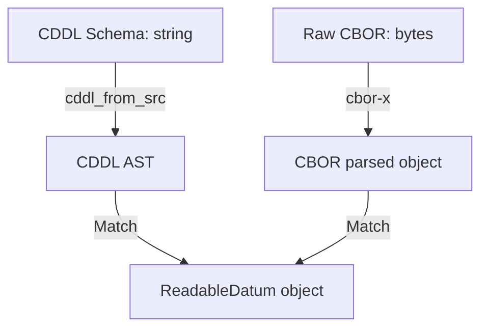
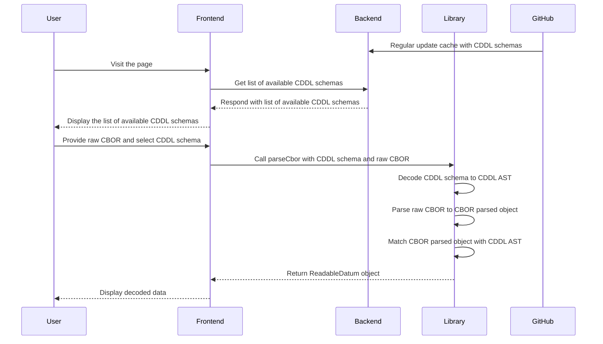

# Architecture

The Datum Explorer architecture is designed to efficiently decode CBOR data using schema definitions.
The core functionality is implemented using Rust, WebAssembly (WASM), and TypeScript libraries,
ensuring high performance and seamless integration with modern web applications.

## Components

1. CDDL Parser
   - Utilizes the [cddl](https://github.com/anweiss/cddl/) Rust crate to decode CDDL (Concise Data Definition Language) from a string into an Abstract Syntax Tree (AST).
   - **WASM Wrapper**: Wraps the Rust library for use in web environments, enabling the decoding of CDDL into a structured AST.
2. CBOR Parser
   - Uses the [cbor-x](https://github.com/kriszyp/cbor-x) library to parse raw CBOR data into a structured format. It matches the parsed data against the CDDL AST to produce a final JSON representation.
   - The decoding pipeline involves several key intermediary structures:
     - **CddlAst**: Represents the AST produced by decoding the CDDL schema.
     - **CborData**: Represents the raw CBOR data parsed using the cbor-x library.
     - **ReadableDatum**: Represents the final matched structure.
3. Backend
   - Caches schema definitions from a public GitHub repository for reuse and efficient schema retrieval.
4. Frontend
   - Uses the library to decode CBOR data and display the parsed results.
   - It includes functionality for selecting schemas fetched from Backend and suggesting schemas based on input CBOR.

## Library workflow

## Component interaction

