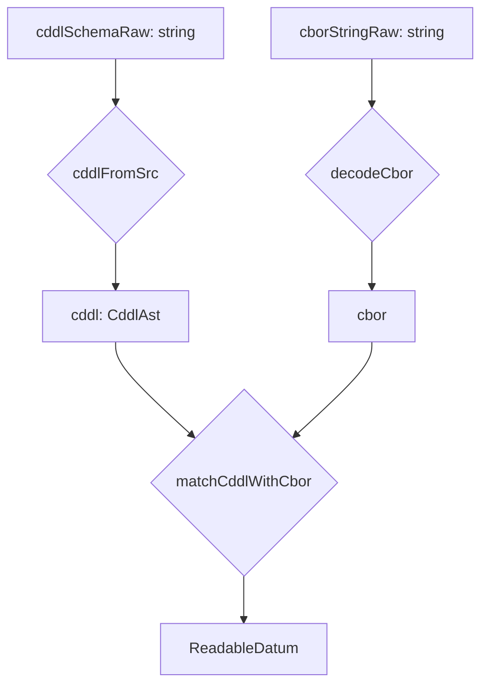
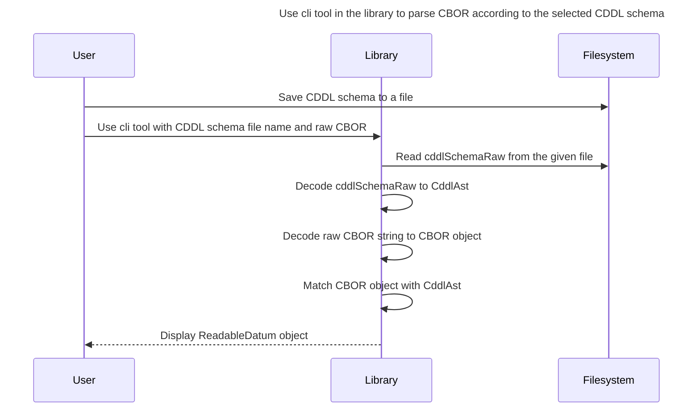

# Architecture

The Datum Explorer architecture is designed to efficiently decode CBOR data using schema definitions.
The core functionality is implemented using Rust, WebAssembly (WASM), and TypeScript libraries,
ensuring high performance and seamless integration with modern web applications.

## Components

1. Library
   - CDDL decoding
     - Utilizes the [cddl](https://github.com/anweiss/cddl/) Rust crate to decode CDDL (Concise Data Definition Language) from a string into an Abstract Syntax Tree (AST).
     - **WASM Wrapper**: Wraps the Rust library for use in web environments, enabling the decoding of CDDL into a structured AST.
   - CBOR decoding
       - Uses the [cbor-x](https://github.com/kriszyp/cbor-x) library to parse raw CBOR string into a structured format.
   - CDDL - CBOR matching
     - Uses CDDL decoding and CBOR decoding to obtain traversable structures
     - Matches the decoded CBOR against the CddlAst to produce a final JSON representation.
     - The pipeline involves several key intermediary structures:
         - **CddlAst**: Represents the AST produced by decoding the CDDL schema.
         - **cbor**: Represents the result of decoding the raw CBOR string by the cbor-x library. Its type is unknown and is unfolding when matching with CddlAst.
         - **ReadableDatum**: Represents the final matched structure.
   - CLI tool
     - Uses CDDL - CBOR matching to display ReadableDatum for the given CDDL schema and raw CBOR data.

## Library workflow

## Component interaction

