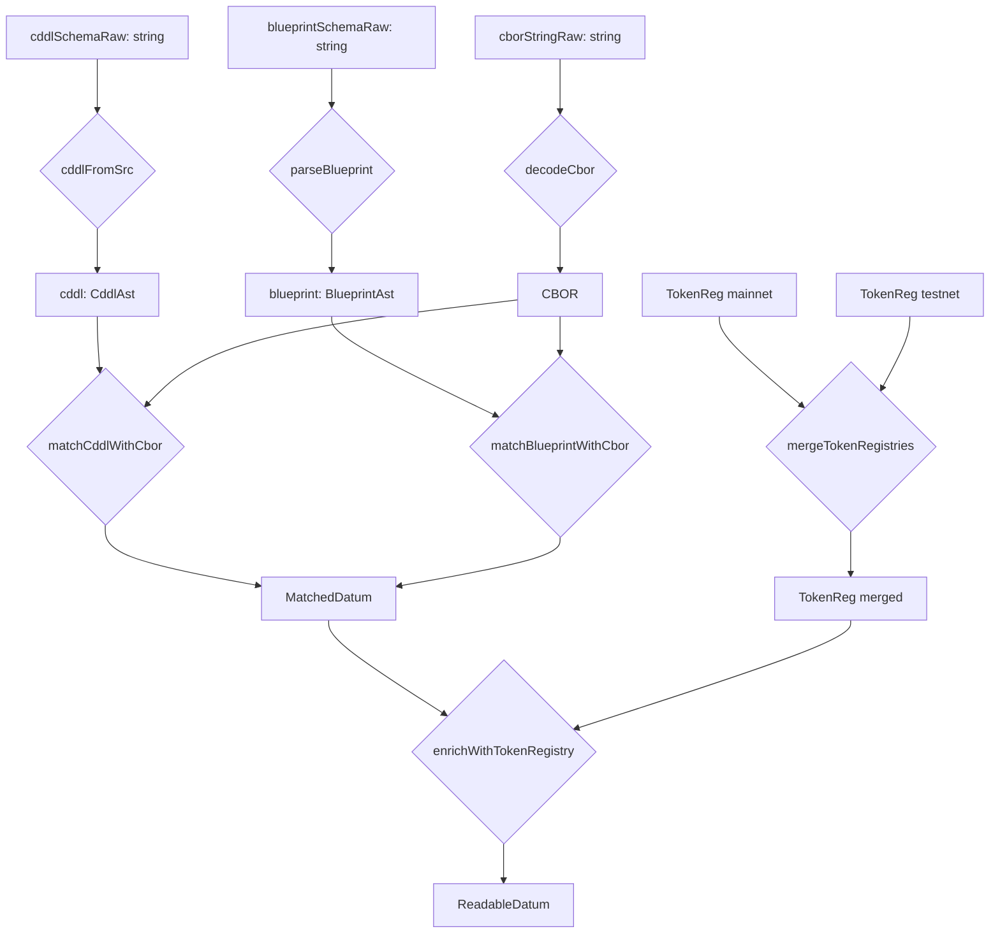
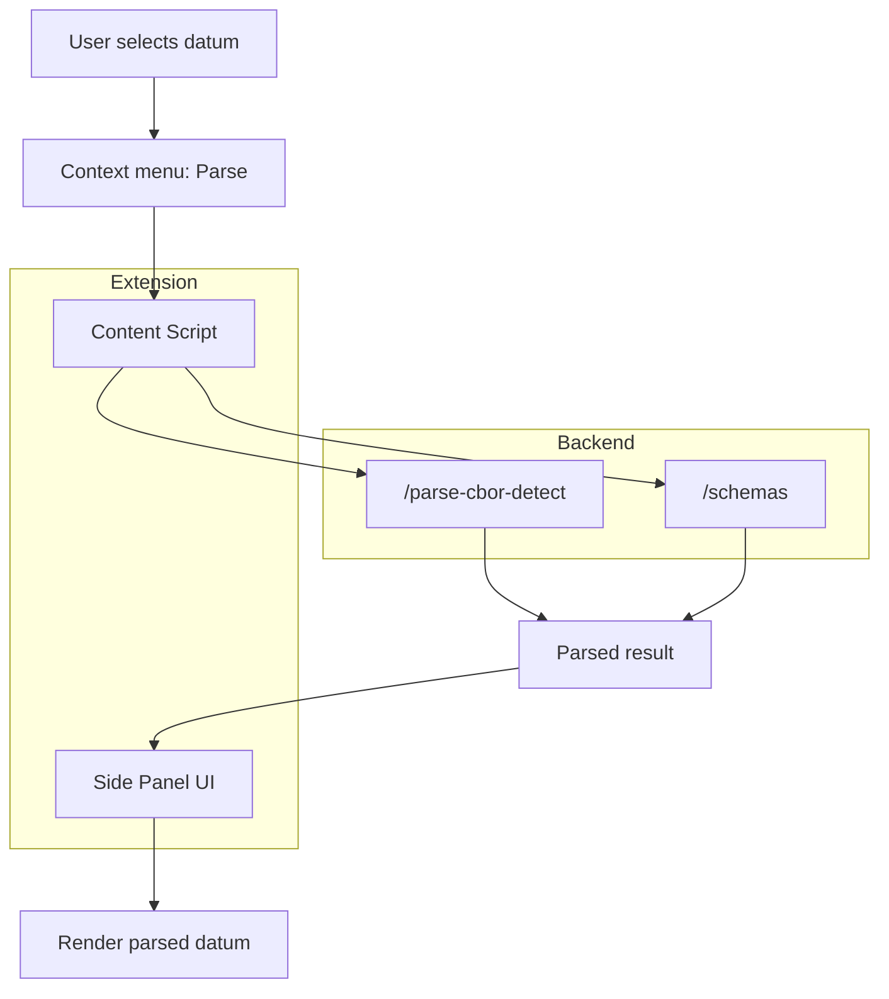
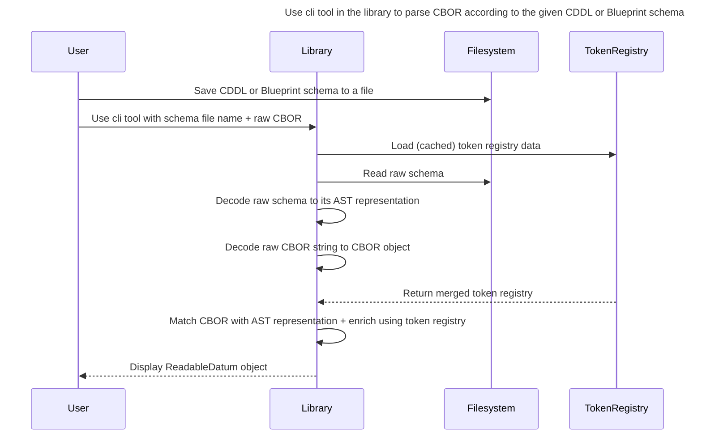
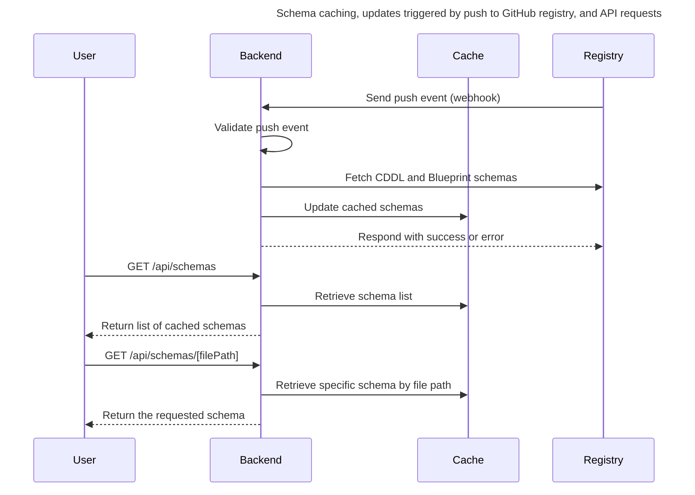

Library workflow:

```mermaid
graph TD
%% Data nodes
    cddlSchemaRaw[cddlSchemaRaw: string]
    cddlAst[cddl: CddlAst]
    blueprintSchemaRaw[blueprintSchemaRaw: string]
    blueprintAst[blueprint: BlueprintAst]
    cborString[cborStringRaw: string]
    cbor[CBOR]
    matchResult[MatchedDatum]
    ReadableDatum[ReadableDatum]
    trMain[TokenReg mainnet]
    trTest[TokenReg testnet]
    mergedTR[TokenReg merged]
%% Process nodes
    matchCddl{matchCddlWithCbor}
    matchBlueprint{matchBlueprintWithCbor}
    cddlFromSrc{cddlFromSrc}
    parseBlueprint{parseBlueprint}
    decodeCbor{decodeCbor}
    enrich{enrichWithTokenRegistry}
    mergeTR{mergeTokenRegistries}
%% Connections
    cddlSchemaRaw --> cddlFromSrc --> cddlAst
    blueprintSchemaRaw --> parseBlueprint --> blueprintAst
    cborString --> decodeCbor --> cbor
    cddlAst --> matchCddl --> matchResult
    blueprintAst --> matchBlueprint --> matchResult
    cbor --> matchCddl
    cbor --> matchBlueprint
    trMain --> mergeTR
    trTest --> mergeTR --> mergedTR
    matchResult --> enrich --> ReadableDatum
    mergedTR --> enrich
```

Chrome extension workflow:

```mermaid
flowchart TD
    A[User selects datum] --> B[Context menu: Parse]
    B --> C[Content Script]
    C --> D["/parse-cbor-detect"]
    C --> E["/schemas"]
    D --> F[Parsed result]
    E --> F
    F --> G[Side Panel UI]
    G --> H[Render parsed datum]
    subgraph Extension
        C
        G
    end
    subgraph Backend
        D
        E
    end
```

Component interaction when using CLI:

```mermaid
---
title: Use cli tool in the library to parse CBOR according to the given CDDL or Blueprint schema
---
sequenceDiagram
    participant User
    participant Library
    participant Filesystem
    participant TokenRegistry

    User->>Filesystem: Save CDDL or Blueprint schema to a file
    User->>Library: Use cli tool with schema file name + raw CBOR
    Library->>TokenRegistry: Load (cached) token registry data
    Library->>Filesystem: Read raw schema
    Library->>Library: Decode raw schema to its AST representation
    Library->>Library: Decode raw CBOR string to CBOR object
    TokenRegistry-->>Library: Return merged token registry
    Library->>Library: Match CBOR with AST representation + enrich using token registry
    Library-->>User: Display ReadableDatum object
```

Schema fetching and caching:

```mermaid
---
title: Schema caching, updates triggered by push to GitHub registry, and API requests
---
sequenceDiagram
    participant User
    participant Backend
    participant Cache
    participant Registry

    Registry->>Backend: Send push event (webhook)
    Backend->>Backend: Validate push event
    Backend->>Registry: Fetch CDDL and Blueprint schemas
    Backend->>Cache: Update cached schemas
    Backend-->>Registry: Respond with success or error

    User->>Backend: GET /api/schemas
    Backend->>Cache: Retrieve schema list
    Backend-->>User: Return list of cached schemas

    User->>Backend: GET /api/schemas/[filePath]
    Backend->>Cache: Retrieve specific schema by file path
    Backend-->>User: Return the requested schema
```
